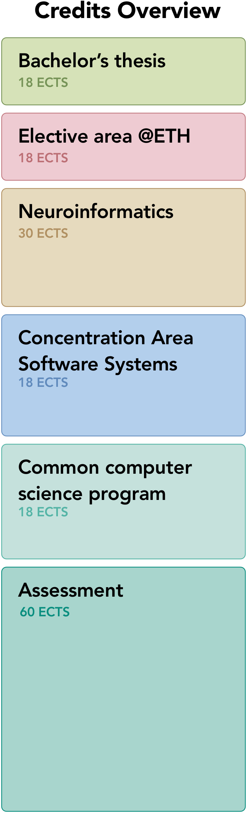

# UZH CS Bachelor with Neuroinformatics

<table>
<tr>

</tr>
<tr>
<td>
This repository is summary of my Bachelor's degree at UZH. Showing all my visited courses, grades, some interesting projects and course work.

I'm a Computer Science student and my degree is split in a major and minor program.

**Major**
**Computer Science** with focus on **Software Systems**. This program focuses on the question of how to develop software-based systems in a systematic, economically efficient way, as well as how to use them and keep them up to date. It looks at everything from small apps and web applications to data management systems and all the way through to super-scaled systems networked on many levels.

**Minor**
**Neuroinformatics** is offered as a minor to Bachelor students at the Institute of Neuroinformatics UZH & ETH. The mission of the Institute is to discover the key principles by which brains work and to implement these in artificial systems that interact intelligently with the real world. The neuroinformatics minor offers a small glimps into that world.

**Current Weighted Grade** 5

**Quick Links:**
* 💯 <a href="./Grades.md">Grades<a>
* 📚 <a href="./Courses.md">All my Courses</a>
* 📆 <a href="./Semesters.md">Courses by Semester Overview</a>

**Websites**
* <a href="https://www.oec.uzh.ch/en/studies/bachelor/it/sosy.html">Department of Informatics - Software Systems</a>
* <a href="https://www.ini.uzh.ch/en/studies/bachelor.html">Institute of Neuroinformatics - Bachelor Minor</a>
  

</td>
<td>

</td>
</tr>
</table

<a href="mailto:hadornjerome@gmail.com">Email Me</a> if you'd like me to remove properiaty content that might have slipped through.

